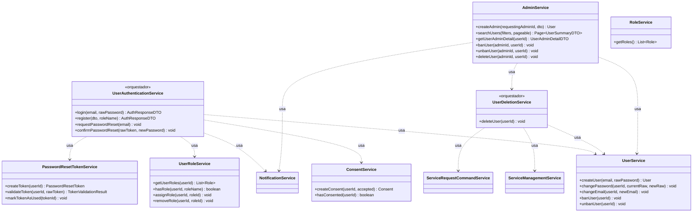
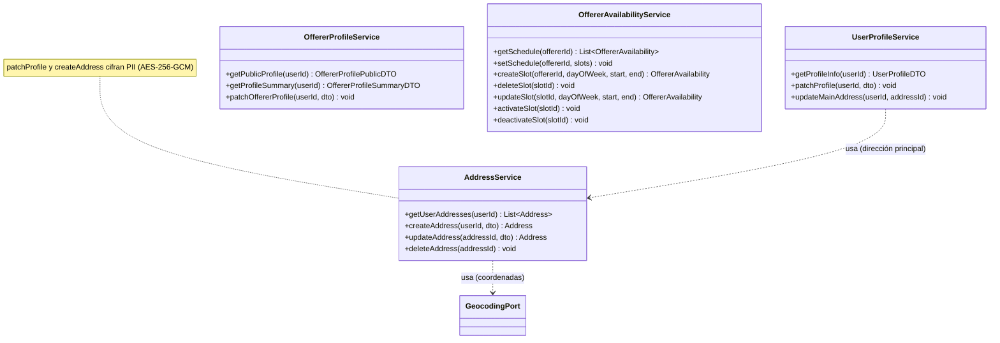
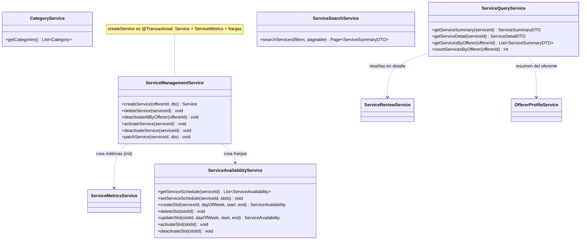
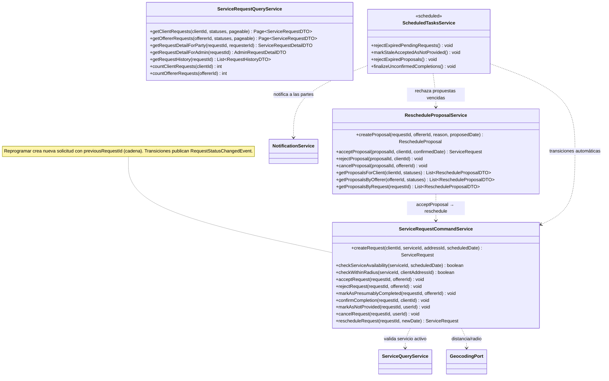
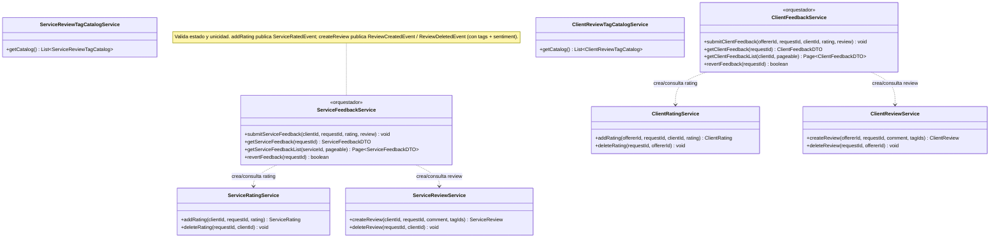
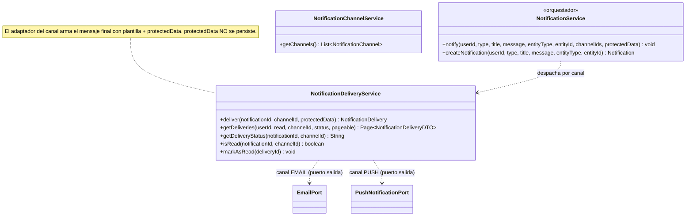
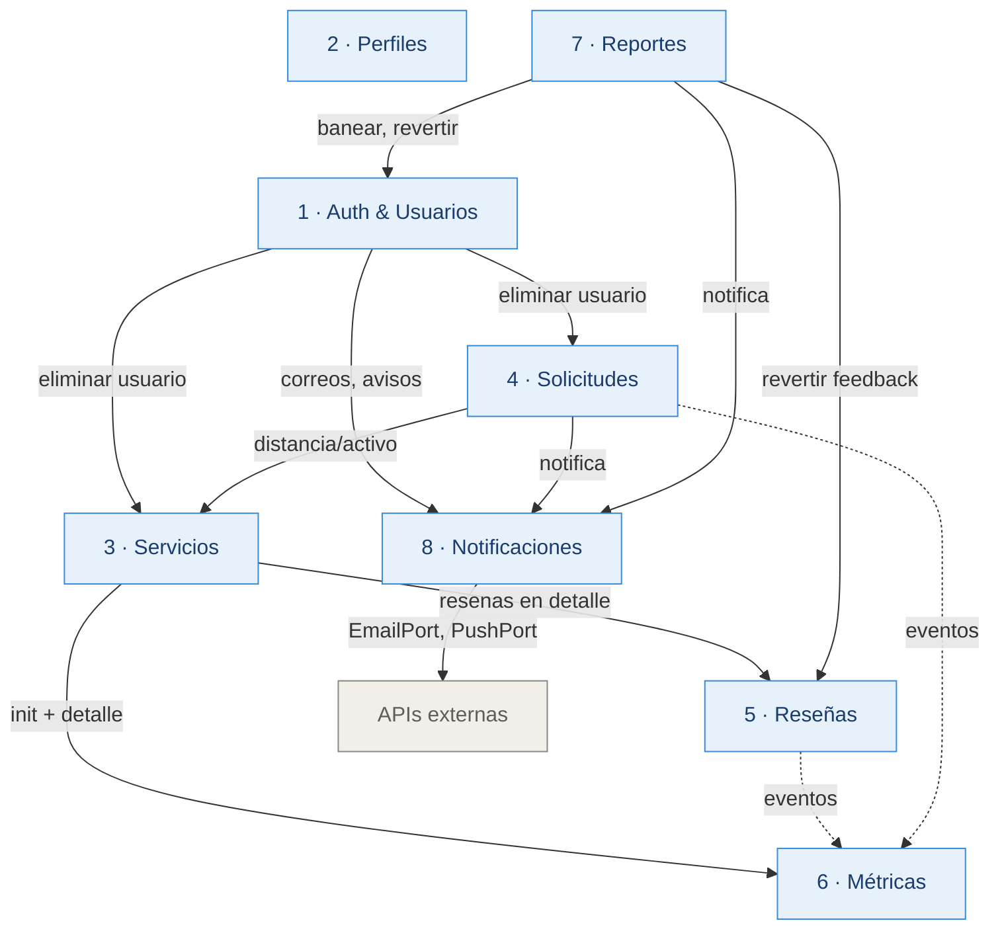

# Diagrama de Clases de Servicio — Marketplace de Servicios

Diagrama de la **capa de servicios** (capa de aplicación), organizado por los 8 módulos del sistema.
Cada bloque es un diagrama Mermaid independiente y renderizable por separado.

> Cómo verlo renderizado: pega cada bloque en [mermaid.live](https://mermaid.live), o abre este archivo en GitHub / VS Code (con extensión Mermaid).

**Convenciones:**
- `<<orquestador>>` — clase que coordina varios servicios en una transacción.
- `<<scheduled>>` — tareas automáticas (`@Scheduled`).
- `..>` (línea punteada) — relación de dependencia ("usa / depende de").
- Los listeners de eventos se indican con una nota; no son llamadas directas sino reacción a eventos publicados.

---

## Módulo 1 — Auth & Usuarios

---

## Módulo 2 — Perfiles

---

## Módulo 3 — Servicios

---

## Módulo 4 — Solicitudes de Servicio

---

## Módulo 5 — Reseñas & Calificaciones

---

## Módulo 6 — Métricas

```mermaid
classDiagram
    class ServiceMetricsService {
        +getMetrics(serviceId) ServiceMetrics
        +updateMetrics(ServiceRatedEvent) void
        +updateReviewCount(ReviewCreatedEvent) void
        +decrementReviewCount(ReviewDeletedEvent) void
    }
    class ServiceTagMetricsService {
        +getTagMetrics(serviceId) List~ServiceTagMetrics~
        +updateTagMetrics(ReviewCreatedEvent) void
        +decrementTagMetrics(ReviewDeletedEvent) void
    }
    class OffererMetricsService {
        +getAllMetrics(offererId) OffererMetrics
        +getMainMetrics(offererId) OffererMetricsSummaryDTO
        +updateMetrics(ServiceRatedEvent) void
        +updateReviewMetrics(ReviewCreatedEvent) void
        +decrementReviewMetrics(ReviewDeletedEvent) void
        +updateRequestMetrics(RequestStatusChangedEvent) void
    }
    class ClientMetricsService {
        +getAllMetrics(clientId) ClientMetrics
        +getMainMetrics(clientId) ClientMetricsSummaryDTO
        +updateMetrics(ClientRatedEvent) void
        +updateReviewMetrics(ReviewCreatedEvent) void
        +decrementReviewMetrics(ReviewDeletedEvent) void
        +updateRequestMetrics(RequestStatusChangedEvent) void
    }
    class OffererTagMetricsService {
        +getTagMetrics(offererId) List~OffererTagMetrics~
        +updateTagMetrics(ReviewCreatedEvent) void
        +decrementTagMetrics(ReviewDeletedEvent) void
    }
    class ClientTagMetricsService {
        +getTagMetrics(clientId) List~ClientTagMetrics~
        +updateTagMetrics(ReviewCreatedEvent) void
        +decrementTagMetrics(ReviewDeletedEvent) void
    }

    note for ServiceMetricsService "Todos los update* son @EventListener: reaccionan a eventos, no se llaman directamente. Patrón UPSERT en las métricas de tags."
```

---

## Módulo 7 — Reportes

```mermaid
classDiagram
    class ReportService {
        +createBaseReport(reporterId, reportedUserId, type, category, reason) Report
        +getReportDetail(reportId) ReportDetailDTO
        +getReports(type, category, status, pageable) Page~ReportDTO~
        +getReportsByReporter(reporterId) List~ReportDTO~
        +getReportsByReportedUser(reportedUserId) List~ReportDTO~
        +countReportsByReportedUser(reportedUserId) int
        +countReportsByReporter(reporterId) int
    }
    class RequestReportService {
        +createRequestReport(reporterId, reportedUserId, category, reason, requestId) RequestReport
        +getRequestReportDetail(reportId) RequestReportDetailDTO
    }
    class ServiceReviewReportService {
        +createReport(reporterId, reportedUserId, category, reason, serviceReviewId) ServiceReviewReport
        +getReportDetail(reportId) ServiceReviewReportDetailDTO
    }
    class ClientReviewReportService {
        +createReport(reporterId, reportedUserId, category, reason, clientReviewId) ClientReviewReport
        +getReportDetail(reportId) ClientReviewReportDetailDTO
    }
    class ReportActionService {
        +createAction(reportId, adminId, actionTaken) ReportAction
        +getActionsByReport(reportId) List~ReportAction~
    }
    class ModerationService {
        <<orquestador>>
        +warnUser(reportId, adminId) void
        +banUserFromReport(reportId, adminId) void
        +revertFeedback(reportId, adminId) void
        +closeReport(reportId, adminId) void
        -finalizeReport(reportId, adminId, actionText) void
    }

    RequestReportService ..> ReportService : createBaseReport
    ServiceReviewReportService ..> ReportService : createBaseReport
    ClientReviewReportService ..> ReportService : createBaseReport
    ModerationService ..> ReportActionService : registra acción
    ModerationService ..> UserService : banUser
    ModerationService ..> ServiceFeedbackService : revertFeedback (delega)
    ModerationService ..> ClientFeedbackService : revertFeedback (delega)
    ModerationService ..> NotificationService : notifica partes
    note for ModerationService "revertFeedback delega en el FeedbackService correspondiente (servicio o cliente) según el tipo de reporte; recibe boolean de confirmación y notifica al reportado. Cada acción cierra el reporte vía finalizeReport (privado): registra ReportAction + cierra + notifica al reportante."
```

---

## Módulo 8 — Notificaciones

---

## Dependencias entre módulos (vista de alto nivel)

> Nota: las flechas punteadas (`-.->`) son comunicación por **eventos** (desacoplada); las sólidas son llamadas directas entre servicios.
